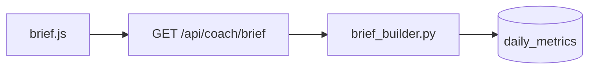

# Lookout — Design Document

## 1. Architecture overview

Lookout is not a service. It is:

- a **Claude Code skill** (`.claude/skills/lookout/SKILL.md` + helper
  scripts) invoked as `lookout <target>` or `lookout pack <targets...>` from
  the vault repo, and
- a **vault repo** (`~/dev/lookout`) containing `targets.yaml`, the markdown
  vault, and the skill itself. One clone gets registry, skill, and vault.

One run = gather one target's state (read-only) → write `raw/` snapshot →
synthesize/update that target's notes → lint → one git commit.

```
~/dev/lookout/
├── targets.yaml                 # registry (targets + shared sources)
├── .claude/skills/lookout/
│   ├── SKILL.md                 # synthesis + atlas + pack instructions
│   └── scripts/
│       ├── gather.py            # all read-only collection → raw/
│       ├── pack.py              # context-pack concatenation
│       └── lint.py              # wikilink + index + ownership checks
└── vault/
    ├── index.md                 # cross-project home (machine-owned)
    ├── agents.md                # control note (human-owned)
    ├── map.md                   # cross-project map (mixed, see §7)
    ├── journal/
    │   └── index.md             # dated cross-links into ~/dev/journal
    ├── ideas/
    │   ├── index.md             # ledger: status column per idea (machine)
    │   └── <date>-<slug>.md     # one per idea (mixed, see §9)
    ├── decisions.md             # global decision log (human-owned, §10)
    ├── learning/
    │   └── global.md            # cert paths, courses (human-owned)
    ├── packs/                   # generated context packs (disposable)
    └── projects/
        └── perf-coach/
            ├── situation.md     # ★ machine-owned
            ├── capability.md    # machine-owned + human "Notes for AI" §
            ├── drift.md         # machine-owned
            ├── todo-view.md     # machine-owned (Notion + repo todo.md)
            ├── atlas/
            │   ├── index.md     # feature list + staleness
            │   └── <feature>.md # one per feature, mermaid inside
            ├── notes.md         # human-owned
            ├── decisions.md     # decision log (human-owned, §10)
            ├── learning.md      # human-owned
            └── raw/
                └── 2026-08-07T09-30/
                    ├── brief.json          # commander brief + history
                    ├── issues.json         # gh output
                    ├── gitlog.txt
                    ├── docs_manifest.json
                    ├── notion_todos.json
                    └── journal_delta.json  # entry refs + extracts
```

**Ownership rule** (enforced by convention + lint): every file is either
**machine-owned** (regenerated each run — situation, capability body, drift,
todo-view, atlas, index, journal index, ideas ledger + assessment blocks,
packs) or **human-owned** (never machine-written — notes, learning,
agents.md, decisions.md, idea freeform tops). Mixed files use marked
sections (§4 capability, §7 map, §9 ideas). One home per fact.

## 2. Target registry

```yaml
# targets.yaml
targets:
  - name: perf-coach
    path: ~/dev/perf-coach/uat
    github: zealchaiwut/perf-coach
    commander_slug: perf-coach
  - name: commander
    path: ~/dev/commander/uat
    github: zealchaiwut/commander
    commander_slug: commander
  # crux, viral-radar, asset-studio same shape

sources:
  commander_api: http://localhost:8000
  notion_todos_db: <database-id>        # token in .env, read-only
  journal_entries: ~/dev/journal/entries
```

## 3. Gather phase (deterministic, read-only)

`gather.py <target>` collects into a timestamped `raw/` folder. A failing
source is recorded as absent in the snapshot manifest — never fatal;
synthesis degrades gracefully and the situation note flags the gap.

| Source | How | Into |
|---|---|---|
| Commander brief | `GET /api/projects/{slug}/brief` | `brief.json` |
| Sprint history | `GET /api/sprints/history` (filtered by project) | `brief.json` |
| Commander health | `GET /api/health` | snapshot manifest |
| GitHub issues/PRs | `gh issue list` / `gh pr list` — read verbs only | `issues.json` |
| Git | `git -C <path> log --oneline -30`, branch, status | `gitlog.txt` |
| Docs | hash + first-heading manifest of README/PRODUCT/DESIGN/SCHEMA/docs/*, plus changed-file list vs previous snapshot | `docs_manifest.json` |
| Notion todos | Notion API `POST /v1/databases/{id}/query` filtered by Project property (+ Global) | `notion_todos.json` |
| Journal | list `entries/*.md` newer than previous snapshot; copy frontmatter + lines matching target names / `## Concerns` | `journal_delta.json` |

**Read-only enforcement:** gather uses only GET/query endpoints and `gh`
read verbs; the Notion token is scoped to the todos database; SKILL.md
forbids write tools against any target path; targets are never a working
directory. The vault is the only write surface.

**Credentials:** existing `gh` token + one Notion integration token in the
vault repo's `.env` (gitignored). Nothing else.

## 4. Synthesis phase (Claude Code, in-run)

SKILL.md instructs Claude Code to read the new snapshot, the previous
machine-owned notes, and human `notes.md`, then regenerate machine-owned
notes. **LLM narrates; snapshots are the facts** — no claim in a machine note
without a snapshot source.

### situation.md template

```markdown
---
target: perf-coach
run: 2026-08-07T09:30
sources_ok: [brief, issues, git, docs, notion, journal]
---
# perf-coach — situation

**One-liner:** <state in one sentence>

## Capacity
<from brief + health: sprint running? blocked count? verdict line:
"clear to start new work" / "sprint N running, wait" / "2 blocked first">

## Since last run
<delta vs previous snapshot: merged, shipped, new issues, label moves,
docs changed>

## What to do next
<ordered, ≤5, each [[wikilinked]]; from brief in_progress/blocked/waiting
+ Notion todos + docs/todo.md forward items>

## From the journal
<entries mentioning this project since last run: date links + one-line gist>

## Open questions
<decision-ready, each with a stable ID like PC-Q7 and options where the
evidence supports them; resolved ones (per [[decisions]]) drop out>
## Drift (top 3 — full list in [[drift]])
```

### capability.md template (feature 8, per target)

Token budget ~1.5K. Machine-owned **except** the final section.

```markdown
---
target: perf-coach
run: 2026-08-07T09:30
---
# perf-coach — capability card

**What it is:** <2 sentences, no marketing>

## Data it owns
<the tables/exports that matter, one line each>

## Read surfaces
<concrete endpoints/files with one example call each — e.g. the four
read-only GET endpoints (training load, performance scores, today's
session, recent weight), localhost/tailnet only>

## How to make it do things
<commander slug, bulk-create path, key CLI entry points>

## Constraints
<localhost-only, never-writes rules, rate limits>

**Current state:** see [[situation]]

## Notes for AI            <!-- human-owned: preserved verbatim across regens -->
```

### Other machine-owned notes

- **drift.md** — docs claiming what git contradicts, todo items commander
  marks done, SCHEMA vs migration mentions. Flag = claim + evidence path +
  suggested fix (text only).
- **todo-view.md** — section 1: Notion todos for this project (the write
  home is Notion; banner says so). Section 2: repo `docs/todo.md` mirror
  (banner: auto-maintained by commander). Annotations go in [[notes]].
- **journal/index.md** — dated list linking `~/dev/journal/entries/` files,
  tagged with mentioned projects. Full entries never copied.
- **index.md** — one row per target: one-liner, capacity, todo count,
  last-run age (>7 days badges stale).

## 5. Feature atlas (code-level)

Per target, `atlas/` holds one note per feature plus an index.

```markdown
---
feature: coach-brief
files: [apps/routers/coach.py, services/brief_builder.py, static/src/brief.js]
traced: 2026-08-07
stale: false
---
# Coach brief

**What it does / entry points / related issues**



**Key files** — one line each on their role.
```

Mechanics:

- **Seeding:** feature list drawn from the target's README feature table /
  `docs/features/`; you can add/remove features in `atlas/index.md`'s
  human section.
- **Tracing:** Claude Code reads the feature's actual source files during
  the run and writes the flow — request path, data flow, key calls. Deep
  whole-repo graphs stay Understand-Anything's job (linked out on demand).
- **Staleness:** gather diffs `git log` against each note's `files:`
  frontmatter; touched files mark the note `stale: true`.
- **Cost cap:** each run re-traces at most 3 stale/new features (oldest
  first); the atlas index shows what's still pending.
- **Diagrams:** Mermaid inside markdown — renders on GitHub and Obsidian,
  diffs in git, no SVG toolchain.

## 6. Journal reader

No ingest is built — the existing journal repo (Scribe → Gmail → Vision OCR
→ `entries/YYYY-MM-DD.md`, launchd 05:45 on zeal-server) is consumed as a
read-only source. Gather extracts per-target mentions and `## Concerns`
lines from new entries; synthesis places them in the situation note's
"From the journal" section and the global journal index. If the journal repo
is on the mini and the run is on the laptop, the entries dir is read via the
git-synced clone — entries are committed, per the journal repo's own design.

## 7. Cross-project map (`map.md`)

Two marked sections:

- **Edges (machine-drafted):** producer → consumer lines derived from
  capability cards ("viral-radar produces post-performance patterns;
  asset-studio consumes content briefs; perf-coach exposes read-only
  training data; crux runs probe pipelines").
- **Pipelines (human-owned):** curated, named combos — e.g.
  `content-loop: viral-radar → perf-coach → crux → asset-studio` with a
  paragraph on when to use it. Lookout never edits this section; it links
  pipelines from the index.

## 8. Context pack builder

`lookout pack perf-coach viral-radar crux asset-studio` →
`vault/packs/2026-08-07-content-loop.md`:

1. Header: generated date, targets, staleness warnings for any card whose
   run is >7 days old.
2. The selected `capability.md` cards in order.
3. Each target's situation **one-liner + capacity line** only.
4. `map.md` (both sections).
5. Footer: the read-only ground rules from `agents.md`.

Deterministic concatenation (`pack.py`, no LLM) so packs are cheap and
trustworthy. Use: paste into a fresh claude.ai session and ask composition
questions; Claude Code skips the pack and reads the same vault paths
directly. Packs are disposable artifacts — regenerating is the norm.

## 9. Idea ledger + feasibility triage

One note per idea in `vault/ideas/`, mixed-ownership:

```markdown
---
idea: hermes-journal-summary
created: 2026-08-07
status: assessed        # idea | assessed | promoted | shipped | parked
targets: [hermes, journal, viral-radar, crux]
issues: []              # human drops commander issue numbers on promote
assessed: 2026-08-07
---
# Hermes summarizes my journal + suggests cross-project connections

<human freeform — the raw idea, never machine-edited>

## Assessment            <!-- machine-owned, regenerated -->
**Already exists:** journal pipeline emits daily brief JSON for Hermes;
viral-radar exposes pattern data ([[viral-radar/capability]]).
**Must be built:** a Hermes skill consuming the brief; a suggest step
joining viral-radar + crux outputs.
**Effort:** M
**Dependencies:** Hermes execute_code fix must land first.
**Suggested first slice:** <one small testable step>
```

Mechanics:

- **Trigger:** part of every run (or `lookout assess`) — only notes that
  are new or human-edited since their `assessed:` date, capped per run
  like the atlas.
- **Grounding:** every Assessment claim must cite a snapshot, atlas note,
  or capability card — same LLM-narrates-facts rule as §4.
- **Lifecycle tracking:** when `issues:` is non-empty, later runs check
  those issue numbers in the snapshots and advance status to `shipped`
  when all close. `ideas/index.md` is the machine-generated ledger table
  (idea, status, effort, blocked-by, age).
- **Todo enrichment:** the same assessment pass annotates entries in
  `todo-view.md` (effort, blocked-by) — vault-side only; Notion is never
  written.
- **Mirror-only holds:** promotion to commander tickets is manual (or via
  the v2 inbox/promote hook). Lookout assesses; you dispatch.

## 10. Discussion loop: questions out, decisions in

**Question generation (synthesis):** unresolved items — drift flags,
blocked/stalled work, idea-assessment unknowns, carry-overs from human
notes — are phrased as decision-ready questions with **stable IDs**
(`PC-Q7` = perf-coach question 7; IDs never reused). Each carries its
evidence links and, where the snapshot supports it, 2–3 options. Written
into the situation note and idea assessments.

**Discussion pack:** `lookout discuss <target|idea>` (pack.py, no LLM) →
`vault/packs/<date>-discuss-<name>.md`: the open questions + minimal
grounding (capability card, situation one-liner + capacity, the drift/atlas
excerpts each question cites). Paste into a claude.ai session, discuss,
decide.

**Decision log (`decisions.md`, human-owned):** after the discussion, one
five-line entry per outcome:

```markdown
## 2026-08-12 — PC-Q7
**Decision:** keep Render Starter; revisit only if memory alerts recur.
**Why:** shared app needs always-on; Standard adds cost without evidence.
**Affects:** perf-coach deploy docs; parked ticket #204.
```

**Read-back (next run):** questions whose IDs appear in a decision entry
are marked resolved and drop from the open list; decisions are cross-linked
from situation/idea notes; and if a target's docs or todo state contradict
a logged decision, a **drift flag** is raised with suggested edit text —
the actual doc update ships as a commander ticket. Lookout remembers and
nags; commander applies. Read-only holds.

## 11. Lint + commit

`lint.py`: broken wikilinks; index rows ↔ project folders; machine-owned
files hand-edited since last run (warn); capability cards over token budget
(warn); snapshot age; ideas with status `promoted` but empty `issues:`
(warn); decision entries referencing unknown question IDs (warn); open
questions older than 14 days (info). Run ends with one commit:
`lookout(perf-coach): <situation one-liner>`.

## 12. Failure modes

| Failure | Behavior |
|---|---|
| Commander down | brief absent; synthesis uses issues + git; capacity says "commander unreachable — state unverified" |
| Notion token invalid / rate-limited | last `notion_todos.json` reused; todo-view flags age |
| GitHub rate limit | last `issues.json` reused; flagged |
| Journal repo missing/behind | journal section notes the gap; nothing else affected |
| Target path missing | run aborts for that target with instruction; vault untouched |
| Atlas trace over budget | remaining stale notes stay flagged; index shows the queue |

## 13. v2 hooks (designed-for, not built)

- **Nightly:** launchd runs `lookout --all` headless on zeal-server —
  identical writer to manual runs, so no conflict model needed. Follows the
  journal repo's proven launchd patterns (token via env, wake-catchup,
  mkdir lock).
- **Notion digest:** publisher reads `index.md` + one-liners, writes one
  Notion page via MCP. Strictly derived, never a source.
- **Inbox/promote:** would add human-owned `inbox/` + a promote script
  emitting bulk-create sprint files (`YYYY-MM-DD-N-slug.md`). Ticket front
  door stays commander until the mirror has earned trust.
- **Hermes:** reads `situation.md` paths from `targets.yaml`; no API.

## 14. Build order (maps to milestones)

1. **M1** — repo scaffold, `targets.yaml`, `agents.md`, empty index, lint
   skeleton.
2. **M2** — `gather.py` complete for perf-coach (all seven sources,
   degradation, snapshot manifest).
3. **M3** — SKILL.md synthesis: situation + drift + todo-view + journal
   links + capability card + question generation + decision read-back for
   perf-coach.
4. **M4** — atlas seeding, tracing, staleness, cap; top-5 perf-coach
   features.
5. **M5** — register commander/crux/viral-radar/asset-studio; `map.md`;
   `pack.py` (context + discuss packs); full lint; commit convention;
   4-project pack test.
6. **M6** — `ideas/` ledger, assessment pass in SKILL.md, lifecycle
   tracking, todo enrichment; closes v1.
7. **M7** — nightly launchd, Notion digest, inbox/promote, Hermes reader.
