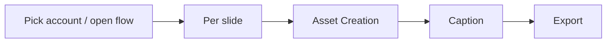
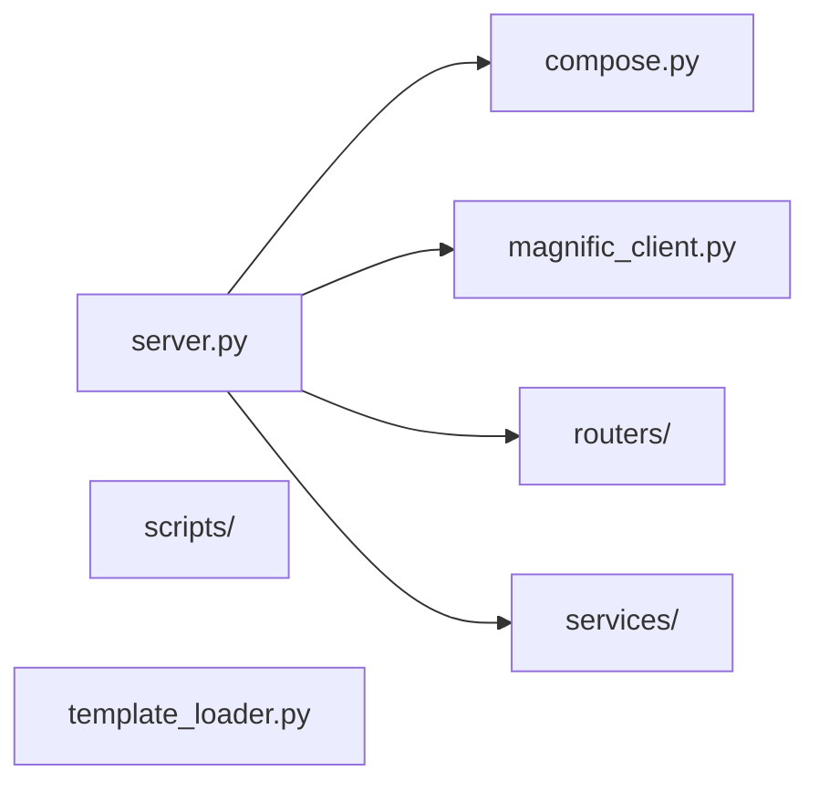

# asset-studio — Discovery

Start-here page for this project: product flow, API map, shallow module map, and atlas. Machine-generated from docs, the latest snapshot, and the local clone. Lookout does not invent edges.

## One-liner

Asset-studio is a local web app for social media creators to build and export multi-slide carousels using AI image upscaling (Magnific) and generation (Mystic) paired with text compositing and brand templates. Batch flows process multiple images with visual consistency locks, and job state persists across server restarts to survive interrupted workflows.

## Product flow

From `asset-studio` `PRODUCT.md` (5 step(s)). Full detail: [[projects/asset-studio/flow]].

- **Pick account / open flow** — select the brand account, create or reopen a draft
- **Per slide** — choose layout (cover / content / cta / quote / …), enter required
- **Asset Creation** — create characters (Magnific IDs + action presets), generate
- **Caption** — unlocks after all required slide texts are saved; Thai caption +
- **Export** — render slides and download a ZIP (always, including 1-slide flows;

## API map

Documented GET surfaces from the latest snapshot. Atlas / Handler columns fill when an atlas note cites the path (deterministic join — no live server calls).

| API name | API | Example | Atlas | Handler |
|---|---|---|---|---|
| Main asset studio UI | `GET /` | `curl -sS http://localhost:8000/` → `200 JSON — Main asset studio UI` | — | — |
| Poll a job's status | `GET /api/job/{id}` | `curl -sS http://localhost:8000/api/job/example` → `200 JSON — Poll a job's status` | — | — |
| List all jobs (session-scoped) | `GET /api/jobs` | `curl -sS http://localhost:8000/api/jobs` → `200 JSON — List all jobs (session-scoped)` | — | — |
| Load brand profile | `GET /api/profile` | `curl -sS http://localhost:8000/api/profile` → `200 JSON — Load brand profile` | — | — |
| Profile fields for generation prompts | `GET /api/profile/instruction-context` | `curl -sS http://localhost:8000/api/profile/instruction-context` → `200 JSON — Profile fields for generation prompts` | — | — |
| List available slide templates | `GET /api/templates` | `curl -sS http://localhost:8000/api/templates` → `200 JSON — List available slide templates` | — | — |
| Aggregated batch status: per-job state, counts, and 'total_cost_usd' rollup | `GET /api/batch/{id}` | `curl -sS http://localhost:8000/api/batch/example` → `200 JSON — Aggregated batch status: per-job state, counts, and 'total_cost_usd' rollup` | — | — |
| List registered accounts | `GET /api/accounts` | `curl -sS http://localhost:8000/api/accounts` → `200 JSON — List registered accounts` | — | — |
| List an account's layouts with their slot manifests | `GET /api/accounts/{handle}/templates` | `curl -sS http://localhost:8000/api/accounts/example/templates` → `200 JSON — List an account's layouts with their slot manifests` | — | — |
| Poll a character-generation job | `GET /api/accounts/{handle}/characters/jobs/{id}` | `curl -sS http://localhost:8000/api/accounts/example/characters/jobs/example` → `200 JSON — Poll a character-generation job` | — | — |
| List cutouts (optional 'action' filter) | `GET /api/accounts/{handle}/characters/cutouts` | `curl -sS http://localhost:8000/api/accounts/example/characters/cutouts` → `200 JSON — List cutouts (optional 'action' filter)` | — | — |
| Get slide-editor flow state | `GET /api/slide-editor/flows/{id}` | `curl -sS http://localhost:8000/api/slide-editor/flows/example` → `200 JSON — Get slide-editor flow state` | — | — |
| Slot manifest + current text for a slide | `GET /api/slide-editor/flows/{id}/slides/{i}/slots` | `curl -sS http://localhost:8000/api/slide-editor/flows/example/slides/example/slots` → `200 JSON — Slot manifest + current text for a slide` | — | — |
| Render a slide preview PNG | `GET /api/slide-editor/flows/{id}/slides/{i}/preview` | `curl -sS http://localhost:8000/api/slide-editor/flows/example/slides/example/preview` → `200 JSON — Render a slide preview PNG` | — | — |
| List all flows (queue view: status, title, timestamps) | `GET /api/v2/flows` | `curl -sS http://localhost:8000/api/v2/flows` → `200 JSON — List all flows (queue view: status, title, timestamps)` | — | — |
| Get v2 flow state | `GET /api/v2/flows/{id}` | `curl -sS http://localhost:8000/api/v2/flows/example` → `200 JSON — Get v2 flow state` | — | — |
| Preview a v2 slide PNG | `GET /api/v2/flows/{id}/slides/{i}/preview` | `curl -sS http://localhost:8000/api/v2/flows/example/slides/example/preview` → `200 JSON — Preview a v2 slide PNG` | — | — |

## Module map

Shallow map of entry points and top-level packages under the `asset-studio` clone (deterministic import skim, capped at 15 nodes). Not a full call graph.

## Feature atlas

[[projects/asset-studio/atlas/index|Atlas index]] — **2** traced / **28** features.

Sample features:

- [[projects/asset-studio/atlas/ai-outline-generation|ai-outline-generation]]
- [[projects/asset-studio/atlas/batch-flow|batch-flow]]
- [[projects/asset-studio/atlas/brand-settings|brand-settings]]
- [[projects/asset-studio/atlas/caption-hashtags-generation|caption-hashtags-generation]]
- [[projects/asset-studio/atlas/carousel-builder|carousel-builder]]
- [[projects/asset-studio/atlas/carousel-builder-flow-v2|carousel-builder-flow-v2]]
- [[projects/asset-studio/atlas/character-action-generation|character-action-generation]]
- [[projects/asset-studio/atlas/character-cutout-library|character-cutout-library]]

## Read next

- [[projects/asset-studio/situation|Situation]] — current state

- [[projects/asset-studio/capability|Capability]] — full API card

- [[projects/asset-studio/flow|Flow]] — product lifecycle + how work ships

- [[projects/asset-studio/changelog|Changelog]] — PRs and git history

- [[projects/asset-studio/todo-view|Todo view]] — open work

