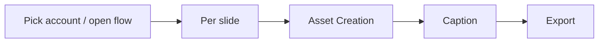
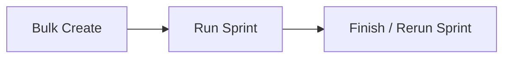

# asset-studio — Flow

Machine-generated from the target's own docs and atlas. Lookout does not invent features or stages. Product lifecycle comes from PRODUCT.md when present; the shared Commander sprint template in `docs/workflow.md` is listed separately as how work ships.

## Product lifecycle

Extracted from `asset-studio` `PRODUCT.md` (5 numbered step(s)).

### Pick account / open flow

select the brand account, create or reopen a draft

### Per slide

choose layout (cover / content / cta / quote / …), enter required

### Asset Creation

create characters (Magnific IDs + action presets), generate

### Caption

unlocks after all required slide texts are saved; Thai caption +

### Export

render slides and download a ZIP (always, including 1-slide flows;

## How work ships

From `asset-studio` `docs/workflow.md` — the Commander sprint pipeline used to build this project (3 stage(s)). This is how tickets ship, not the end-user product flow.

### Stage 1 — Bulk Create

- Paste prompts (separated by `---`) into the Bulk Create tab. - **BA agent** drafts each ticket (title, body, AC, UAT steps), one per prompt. - **Estimator** sizes each draft (S/M/L/XL). - Review and edit the drafts, then post the selected ones as GitHub issues.

### Stage 2 — Run Sprint

For each ticket in a `sprint-N` label:

### Stage 3 — Finish / Rerun Sprint

- **Finish:** the human reviews UAT tickets, closes the good ones; a sprint summary is posted as a GitHub issue, which marks the sprint finished. - **Rerun:** tickets tagged `needs-rework` run as an independent sub-sprint (`sprint-N.1`, `sprint-N.2`, …) with their own label, branch, PR, and summary.

## Architecture (from the project)

_`docs/architecture.md` has no `flowchart LR` mermaid block to copy._

## Sitemap

Feature inventory lives in the atlas: [[projects/asset-studio/atlas/index]].

Docs recorded in the latest snapshot:

- `README.md`
- `PRODUCT.md`
- `DESIGN.md`
- `SCHEMA.md`
- `docs/architecture/code-state.md`
- `docs/architecture.md`
- `docs/bulk-create/README.md`
- `docs/features/README.md`
- `docs/features/carousel-content-brief.md`
- `docs/features/carousel.md`
- `docs/milestones.md`
- `docs/quickstart.md`
- `docs/templates.md`
- `docs/todo.md`
- `docs/tutorial.md`
- `docs/workflow.md`

