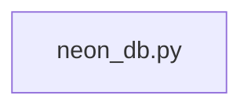

## What

Neon DB — traced from `services/sprint_manager/neon_db.py` through 1 source file(s).

## Entry Points

- `services/sprint_manager/neon_db.py` (tracing origin)

## Related Issues

_No related issues found in snapshot._

## Flowchart

## Key Files

- `neon_db.py` — traced during import walk

## Open Questions

<!-- OPEN QUESTION: `sqlalchemy` imported in `neon_db.py` but `sqlalchemy.py` not found in source — handler unresolved -->
