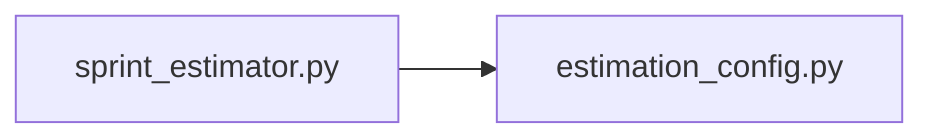

## What

Sprint Estimator — traced from `scripts/sprint_estimator.py` through 2 source file(s).

## Entry Points

- `scripts/sprint_estimator.py` (tracing origin)

## Related Issues

- #2265 — Sprint 1021 Executive Summary
- #2249 — Delete the sprint orchestrator
- #2248 — Attach sprint-summary generation to the Finish flow
- #2247 — Run and reasoning views tolerate a missing sprint label
- #2244 — Delete tests covering the sprint-1022 removals
- #2239 — Remove post-sprint auto-dispatched agents
- #2238 — Remove the overnight sprint scheduler
- #2227 — [bug] Sprint rerun silently excludes any ticket carrying the docs AREA label — conflated with the docs/sprint-summary auto-generated-issue filter
- #2225 — [bug] Documenter/reviewer hitting a Claude session-limit strands the sprint in needs_rework with no auto-retry, and a later reviewer failure never updates the terminal state at all
- #2224 — [bug] Sprint-level agent failures (documenter/reviewer) write last-failure-0.json to commander's own repo instead of the dispatching project's, colliding across projects and sprints

## Flowchart

## Key Files

- `sprint_estimator.py` — traced during import walk
- `estimation_config.py` — traced during import walk

## Open Questions

<!-- OPEN QUESTION: `dotenv` imported in `sprint_estimator.py` but `dotenv.py` not found in source — handler unresolved -->
<!-- OPEN QUESTION: `github_client` imported in `sprint_estimator.py` but `github_client.py` not found in source — handler unresolved -->
