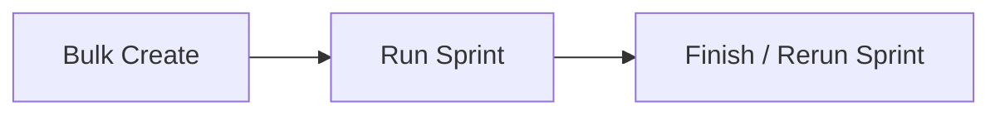
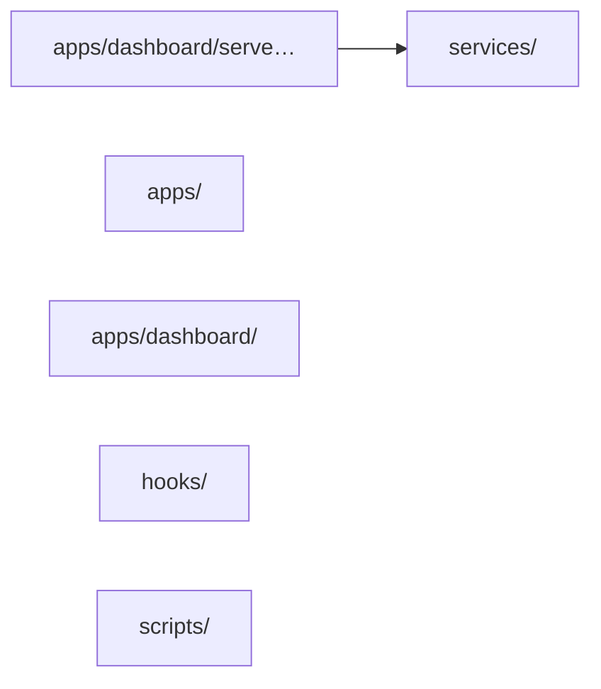

# commander — Discovery

Start-here page for this project: product flow, API map, shallow module map, and atlas. Machine-generated from docs, the latest snapshot, and the local clone. Lookout does not invent edges.

## One-liner

Commander automates the solo development workflow (BA → Coder → Tester → UAT) by dispatching Claude Code agents coordinated through a GitHub Issues sprint board and live dashboard. It supports concurrent agent dispatch with pipeline parallelization (coders and testers working simultaneously), multi-coder execution, and automated sprint effort estimation.

## Product flow

From `commander` `docs/workflow.md` (3 stage(s)). Full detail: [[projects/commander/flow]].

- **Bulk Create**
- **Run Sprint**
- **Finish / Rerun Sprint**

## API map

Documented GET surfaces from the latest snapshot. Atlas / Handler columns fill when an atlas note cites the path (deterministic join — no live server calls).

| API name | API | Example | Atlas | Handler |
|---|---|---|---|---|
| Health check | `GET /api/health` | `curl -sS http://localhost:8000/api/health` → `200 JSON — Health check` | — | — |
| Domain-grouped local-only status snapshot, zero GitHub calls | `GET /api/status` | `curl -sS http://localhost:8000/api/status` → `200 JSON — Domain-grouped local-only status snapshot, zero GitHub calls` | — | — |
| Just the sprints slice of '/api/status | `GET /api/status/sprints` | `curl -sS http://localhost:8000/api/status/sprints` → `200 JSON — Just the sprints slice of '/api/status` | — | — |
| Just the health slice of '/api/status | `GET /api/status/health` | `curl -sS http://localhost:8000/api/status/health` → `200 JSON — Just the health slice of '/api/status` | — | — |
| Just the queue slice of '/api/status | `GET /api/status/queue` | `curl -sS http://localhost:8000/api/status/queue` → `200 JSON — Just the queue slice of '/api/status` | — | — |
| Current environment ('prd'/'uat') and version | `GET /api/environment` | `curl -sS http://localhost:8000/api/environment` → `200 JSON — Current environment ('prd'/'uat') and version` | — | — |
| App version string | `GET /api/version` | `curl -sS http://localhost:8000/api/version` → `200 JSON — App version string` | — | — |
| Run install-time host doctor checks, return pass/fail results | `GET /api/doctor` | `curl -sS http://localhost:8000/api/doctor` → `200 JSON — Run install-time host doctor checks, return pass/fail results` | — | — |
| Backup subsystem status | `GET /api/backup/status` | `curl -sS http://localhost:8000/api/backup/status` → `200 JSON — Backup subsystem status` | — | — |
| GitHub CLI auth status | `GET /api/gh-auth-status` | `curl -sS http://localhost:8000/api/gh-auth-status` → `200 JSON — GitHub CLI auth status` | — | — |
| Poll the in-progress login flow | `GET /api/gh-auth/login/status` | `curl -sS http://localhost:8000/api/gh-auth/login/status` → `200 JSON — Poll the in-progress login flow` | — | — |
| Repository configuration (labels, sprint prefix) | `GET /api/repo/config` | `curl -sS http://localhost:8000/api/repo/config` → `200 JSON — Repository configuration (labels, sprint prefix)` | — | — |
| List GitHub labels for the repo | `GET /api/github/labels` | `curl -sS http://localhost:8000/api/github/labels` → `200 JSON — List GitHub labels for the repo` | — | — |
| List active agents with last-seen timestamp | `GET /api/agents` | `curl -sS http://localhost:8000/api/agents` → `200 JSON — List active agents with last-seen timestamp` | — | — |
| List recent agent events (paginated) | `GET /api/events` | `curl -sS http://localhost:8000/api/events` → `200 JSON — List recent agent events (paginated)` | — | — |
| SSE stream — pushed to the Agents tab in real time | `GET /events` | `curl -sS http://localhost:8000/events` → `200 JSON — SSE stream — pushed to the Agents tab in real time` | — | — |
| Recent events for one project | `GET /api/projects/{slug}/events` | `curl -sS http://localhost:8000/api/projects/commander/events` → `200 JSON — Recent events for one project` | — | — |
| List all tracked projects | `GET /api/projects` | `curl -sS http://localhost:8000/api/projects` → `200 JSON — List all tracked projects` | — | — |
| The running sprint for one project, if any | `GET /api/projects/{project}/running-sprint` | `curl -sS http://localhost:8000/api/projects/commander/running-sprint` → `200 JSON — The running sprint for one project, if any` | — | — |
| Full project detail: tickets grouped by status, sprint label, assignee | `GET /api/project-details` | `curl -sS http://localhost:8000/api/project-details` → `200 JSON — Full project detail: tickets grouped by status, sprint label, assignee` | — | — |
| Running-sprint snapshot for a project ('?project='), mirror/DB only | `GET /api/running` | `curl -sS http://localhost:8000/api/running` → `200 JSON — Running-sprint snapshot for a project ('?project='), mirror/DB only` | — | — |
| Home rollup brief across all projects | `GET /api/brief` | `curl -sS http://localhost:8000/api/brief` → `200 JSON — Home rollup brief across all projects` | — | — |
| Deterministic per-project brief (DB-only, no LLM) | `GET /api/projects/{slug}/brief` | `curl -sS http://localhost:8000/api/projects/commander/brief` → `200 JSON — Deterministic per-project brief (DB-only, no LLM)` | — | — |
| Per-project dev report: shipped, stale, waiting, and run-ready sprints | `GET /api/dev-report` | `curl -sS http://localhost:8000/api/dev-report` → `200 JSON — Per-project dev report: shipped, stale, waiting, and run-ready sprints` | — | — |
| Canonical agent operate guide as '{content, version}'; 'version' is a 16-hex SHA-256 fingerprint | `GET /api/agent-guide` | `curl -sS http://localhost:8000/api/agent-guide` → `200 JSON — Canonical agent operate guide as '{content, version}'; 'version' is a 16-hex SHA-256 fingerprint` | — | — |
| List allowed '.md' files in the project's clone root as '[{path, size, mtime}]'. Nested layout resolves the clone root in 'uat'→'main'→'prd' order, preferring the develop-tracking 'uat' clone so docs reflect the most current (unmerged) state (issue #2052) | `GET /api/projects/{slug}/docs` | `curl -sS http://localhost:8000/api/projects/commander/docs` → `200 JSON — List allowed '.md' files in the project's clone root as '[{path, size, mtime}]'. Nested layout resolves the clone root in 'uat'→'main'→'prd' order, preferring the develop-tracking 'uat' clone so docs reflect the most current (unmerged) state (issue #2052)` | — | — |
| Fetch one doc's content as '{path, content} | `GET /api/projects/{slug}/docs/{path}` | `curl -sS http://localhost:8000/api/projects/commander/docs/example` → `200 JSON — Fetch one doc's content as '{path, content}` | — | — |
| Check for missing standard docs files | `GET /api/projects/{slug}/docs/scaffold/check` | `curl -sS http://localhost:8000/api/projects/commander/docs/scaffold/check` → `200 JSON — Check for missing standard docs files` | [[projects/commander/atlas/settings]] | `apps/dashboard/routers/settings.py` |
| Board columns snapshot for a project | `GET /api/board` | `curl -sS http://localhost:8000/api/board` → `200 JSON — Board columns snapshot for a project` | — | — |
| List open issues with label/state filters | `GET /api/issues` | `curl -sS http://localhost:8000/api/issues` → `200 JSON — List open issues with label/state filters` | — | — |
| Open issues including body, for conflict detection | `GET /api/open-issues` | `curl -sS http://localhost:8000/api/open-issues` → `200 JSON — Open issues including body, for conflict detection` | — | — |
| Fetch the test report comment for an issue | `GET /api/issues/{issue_id}/test-report` | `curl -sS http://localhost:8000/api/issues/1/test-report` → `200 JSON — Fetch the test report comment for an issue` | — | — |
| Issues available for sprint assignment, with size estimate | `GET /api/sprint-planning/issues` | `curl -sS http://localhost:8000/api/sprint-planning/issues` → `200 JSON — Issues available for sprint assignment, with size estimate` | — | — |
| Sprint Mgmt panel view (issues grouped by sprint) | `GET /api/sprint-management/issues` | `curl -sS http://localhost:8000/api/sprint-management/issues` → `200 JSON — Sprint Mgmt panel view (issues grouped by sprint)` | — | — |
| List all sprint labels in the repo | `GET /api/sprints` | `curl -sS http://localhost:8000/api/sprints` → `200 JSON — List all sprint labels in the repo` | — | — |
| Get the current sprint goal | `GET /api/sprints/goal` | `curl -sS http://localhost:8000/api/sprints/goal` → `200 JSON — Get the current sprint goal` | — | — |
| Get the sprint ordering list | `GET /api/sprints/order` | `curl -sS http://localhost:8000/api/sprints/order` → `200 JSON — Get the sprint ordering list` | — | — |
| All currently-running sprints across projects | `GET /api/sprints/running-all` | `curl -sS http://localhost:8000/api/sprints/running-all` → `200 JSON — All currently-running sprints across projects` | — | — |
| Branch status for a sprint's tickets | `GET /api/sprints/{sprint_label}/branch-status` | `curl -sS http://localhost:8000/api/sprints/sprint-1/branch-status` → `200 JSON — Branch status for a sprint's tickets` | — | — |
| Preview what a rerun would do | `GET /api/sprints/{sprint_label}/rerun-preview` | `curl -sS http://localhost:8000/api/sprints/sprint-1/rerun-preview` → `200 JSON — Preview what a rerun would do` | — | — |
| Alias preview route | `GET /api/sprints/{sprint_label}/rerun/preview` | `curl -sS http://localhost:8000/api/sprints/sprint-1/rerun/preview` → `200 JSON — Alias preview route` | — | — |
| plan.json' payload | `GET /api/sprints/{sprint_label}/state` | `curl -sS http://localhost:8000/api/sprints/sprint-1/state` → `200 JSON — plan.json' payload` | — | — |
| Full 'state.json' + outcome | `GET /api/sprints/{sprint_label}/state-full` | `curl -sS http://localhost:8000/api/sprints/sprint-1/state-full` → `200 JSON — Full 'state.json' + outcome` | — | — |
| Timing data from 'state.json | `GET /api/sprints/{sprint_label}/state-timing` | `curl -sS http://localhost:8000/api/sprints/sprint-1/state-timing` → `200 JSON — Timing data from 'state.json` | — | — |
| Live snapshot — counts, current ticket, active agent, last 50 log lines, locked 'issues[]' (see below) | `GET /api/sprints/{sprint_label}/live` | `curl -sS http://localhost:8000/api/sprints/sprint-1/live` → `200 JSON — Live snapshot — counts, current ticket, active agent, last 50 log lines, locked 'issues[]' (see below)` | — | — |
| SSE stream of live sprint log lines | `GET /api/sprints/{sprint_label}/live/stream` | `curl -sS http://localhost:8000/api/sprints/sprint-1/live/stream` → `200 JSON — SSE stream of live sprint log lines` | — | — |
| Finish-report card data — always HTTP 200 (see below) | `GET /api/sprints/{sprint_label}/finish-card` | `curl -sS http://localhost:8000/api/sprints/sprint-1/finish-card` → `200 JSON — Finish-report card data — always HTTP 200 (see below)` | — | — |
| Tail of the most recent sprint run log file. '?tail_lines=N' (max 2000) | `GET /api/sprints/{sprint_label}/dispatch-log` | `curl -sS http://localhost:8000/api/sprints/sprint-1/dispatch-log` → `200 JSON — Tail of the most recent sprint run log file. '?tail_lines=N' (max 2000)` | — | — |
| Tail of the most recent per-issue log. '?tail_lines=N' (max 2000) | `GET /api/sprints/{sprint_label}/issue/{issue_num}/log` | `curl -sS http://localhost:8000/api/sprints/sprint-1/issue/1/log` → `200 JSON — Tail of the most recent per-issue log. '?tail_lines=N' (max 2000)` | — | — |
| Structured per-issue segment data for the running-sprint pane (DB-sourced, no disk reads) | `GET /api/sprints/{sprint_label}/timeline` | `curl -sS http://localhost:8000/api/sprints/sprint-1/timeline` → `200 JSON — Structured per-issue segment data for the running-sprint pane (DB-sourced, no disk reads)` | — | — |
| Paginated sprint run history | `GET /api/logs/runs` | `curl -sS http://localhost:8000/api/logs/runs` → `200 JSON — Paginated sprint run history` | — | — |
| Preview what "finish sprint" would do | `GET /api/sprints/{sprint_label}/finish-preview?project=` | `curl -sS http://localhost:8000/api/sprints/sprint-1/finish-preview?project=` → `200 JSON — Preview what "finish sprint" would do` | — | — |
| SSE stream of finish-sprint progress; resends current snapshot on reconnect | `GET /api/sprints/{sprint_label}/finish-stream?project=` | `curl -sS http://localhost:8000/api/sprints/sprint-1/finish-stream?project=` → `200 JSON — SSE stream of finish-sprint progress; resends current snapshot on reconnect` | — | — |
| Dry-run preview of bulk-complete. Returns '400' when the sprint has no child sprints (bulk-complete requires a parent sprint with at least one child) instead of a misleading '200' empty preview (issue #2160). Each 'members[].merged' flag distinguishes a properly-merged-then-pruned branch from one deleted without merging: a branch absent from GitHub is reported 'merged' only when a merged PR into its parent branch exists (issue #2086) | `GET /api/sprints/{sprint_label}/bulk-complete-preview?project=` | `curl -sS http://localhost:8000/api/sprints/sprint-1/bulk-complete-preview?project=` → `200 JSON — Dry-run preview of bulk-complete. Returns '400' when the sprint has no child sprints (bulk-complete requires a parent sprint with at least one child) instead of a misleading '200' empty preview (issue #2160). Each 'members[].merged' flag distinguishes a properly-merged-then-pruned branch from one deleted without merging: a branch absent from GitHub is reported 'merged' only when a merged PR into its parent branch exists (issue #2086)` | — | — |
| Dry-run: GitHub-vs-DB diff + post-sprint checks for one sprint. No writes; requires '?project='. Unknown 'project=' → '404' (issue #2069). Response now also carries 'outcome_mismatch' (bool) and 'outcome_derived_state' (the terminal state re-derived from stored 'issues_json' ticket outcomes): a sprint stored 'ready_to_merge' whose ticket outcomes show a failure/dead-letter is flagged for downgrade to 'needs_rework' even when no GitHub needs-rework label exists (issue #2167) | `GET /api/sprints/{label}/reconcile-preview` | `curl -sS http://localhost:8000/api/sprints/example/reconcile-preview` → `200 JSON — Dry-run: GitHub-vs-DB diff + post-sprint checks for one sprint. No writes; requires '?project='. Unknown 'project=' → '404' (issue #2069). Response now also carries 'outcome_mismatch' (bool) and 'outcome_derived_state' (the terminal state re-derived from stored 'issues_json' ticket outcomes): a sprint stored 'ready_to_merge' whose ticket outcomes show a failure/dead-letter is flagged for downgrade to 'needs_rework' even when no GitHub needs-rework label exists (issue #2167)` | — | — |
| List completed sprint summaries (local, GitHub-free ledger feed) | `GET /api/sprints/history` | `curl -sS http://localhost:8000/api/sprints/history` → `200 JSON — List completed sprint summaries (local, GitHub-free ledger feed)` | — | — |
| Per-run stats for a finished sprint | `GET /api/sprints/{label}/run-stats` | `curl -sS http://localhost:8000/api/sprints/example/run-stats` → `200 JSON — Per-run stats for a finished sprint` | — | — |
| Sprints sitting in the pending sign-off gate | `GET /api/sprints/pending-signoff` | `curl -sS http://localhost:8000/api/sprints/pending-signoff` → `200 JSON — Sprints sitting in the pending sign-off gate` | — | — |
| Full preflight health check before dispatch. Cycle, file-overlap conflict, and dependency-order data are returned inline in this aggregate response (issue #2234). Also returns 'dor_mode' and inline 'readiness' ('ready' / 'not_ready' with per-ticket 'missing' reasons); when 'dor_mode == "block"' and any work ticket is 'not_ready', 'ok' is 'false' (Definition of Ready gate, issue #2262) | `GET /api/sprints/{sprint_label}/preflight` | `curl -sS http://localhost:8000/api/sprints/sprint-1/preflight` → `200 JSON — Full preflight health check before dispatch. Cycle, file-overlap conflict, and dependency-order data are returned inline in this aggregate response (issue #2234). Also returns 'dor_mode' and inline 'readiness' ('ready' / 'not_ready' with per-ticket 'missing' reasons); when 'dor_mode == "block"' and any work ticket is 'not_ready', 'ok' is 'false' (Definition of Ready gate, issue #2262)` | — | — |
| Preview the ticket dependency DAG | `GET /api/sprints/{sprint_label}/preview-dag` | `curl -sS http://localhost:8000/api/sprints/sprint-1/preview-dag` → `200 JSON — Preview the ticket dependency DAG` | — | — |
| Preview DAG-resolved execution order | `GET /api/sprints/{sprint_label}/dag-order-preview` | `curl -sS http://localhost:8000/api/sprints/sprint-1/dag-order-preview` → `200 JSON — Preview DAG-resolved execution order` | — | — |
| Poll an async estimate job | `GET /api/estimate-jobs/{job_id}` | `curl -sS http://localhost:8000/api/estimate-jobs/example` → `200 JSON — Poll an async estimate job` | — | — |
| Get saved estimates for a sprint | `GET /api/sprints/{sprint_label}/estimate` | `curl -sS http://localhost:8000/api/sprints/sprint-1/estimate` → `200 JSON — Get saved estimates for a sprint` | — | — |
| Rolled-up estimate summary for a sprint | `GET /api/sprints/{sprint_label}/estimate-summary` | `curl -sS http://localhost:8000/api/sprints/sprint-1/estimate-summary` → `200 JSON — Rolled-up estimate summary for a sprint` | — | — |
| Batch-fetch estimates for multiple issues | `GET /api/estimates/batch` | `curl -sS http://localhost:8000/api/estimates/batch` → `200 JSON — Batch-fetch estimates for multiple issues` | — | — |
| Actual outcome data for a finished sprint | `GET /api/sprints/{sprint_label}/outcome` | `curl -sS http://localhost:8000/api/sprints/sprint-1/outcome` → `200 JSON — Actual outcome data for a finished sprint` | — | — |
| Estimate-vs-actual comparison | `GET /api/sprints/{sprint_label}/estimate-vs-actual` | `curl -sS http://localhost:8000/api/sprints/sprint-1/estimate-vs-actual` → `200 JSON — Estimate-vs-actual comparison` | — | — |
| Average actual time per size bucket (estimator calibration) | `GET /api/calibration` | `curl -sS http://localhost:8000/api/calibration` → `200 JSON — Average actual time per size bucket (estimator calibration)` | — | — |
| Per-project calibration view | `GET /api/projects/{slug}/analytics/calibration` | `curl -sS http://localhost:8000/api/projects/commander/analytics/calibration` → `200 JSON — Per-project calibration view` | — | — |
| Flagged tickets whose actual size diverged from estimate | `GET /api/sprints/{sprint_label}/mis-sizing-flags` | `curl -sS http://localhost:8000/api/sprints/sprint-1/mis-sizing-flags` → `200 JSON — Flagged tickets whose actual size diverged from estimate` | — | — |
| Historical mis-sizing flag log | `GET /api/mis-sizing/history` | `curl -sS http://localhost:8000/api/mis-sizing/history` → `200 JSON — Historical mis-sizing flag log` | — | — |
| Read mis-sizing detection config | `GET /api/mis-sizing/config` | `curl -sS http://localhost:8000/api/mis-sizing/config` → `200 JSON — Read mis-sizing detection config` | — | — |
| Current sprint run status (per-ticket states) | `GET /api/sprint-status` | `curl -sS http://localhost:8000/api/sprint-status` → `200 JSON — Current sprint run status (per-ticket states)` | — | — |
| Sprint summary for the active or last sprint | `GET /api/sprint-summary` | `curl -sS http://localhost:8000/api/sprint-summary` → `200 JSON — Sprint summary for the active or last sprint` | — | — |
| List completed sprint summaries | `GET /api/sprint-history` | `curl -sS http://localhost:8000/api/sprint-history` → `200 JSON — List completed sprint summaries` | — | — |
| Raw Markdown content of a sprint summary | `GET /api/sprint-history-content` | `curl -sS http://localhost:8000/api/sprint-history-content` → `200 JSON — Raw Markdown content of a sprint summary` | — | — |
| Timeline data across sprints | `GET /api/sprints/timeline` | `curl -sS http://localhost:8000/api/sprints/timeline` → `200 JSON — Timeline data across sprints` | — | — |
| All sprint summaries | `GET /api/sprints/summaries` | `curl -sS http://localhost:8000/api/sprints/summaries` → `200 JSON — All sprint summaries` | — | — |
| Aggregated Home payload: summary stats, per-project cards, last 5 activity events. Per-project data cached 30s; always HTTP 200 | `GET /api/home` | `curl -sS http://localhost:8000/api/home` → `200 JSON — Aggregated Home payload: summary stats, per-project cards, last 5 activity events. Per-project data cached 30s; always HTTP 200` | — | — |
| GitHub-backed sprint status for the nav-bar pill | `GET /api/sprint-nav-status` | `curl -sS http://localhost:8000/api/sprint-nav-status` → `200 JSON — GitHub-backed sprint status for the nav-bar pill` | — | — |

_Showing 80 of 126 endpoints. Full list: [[projects/commander/capability]]._

## Module map

Shallow map of entry points and top-level packages under the `commander` clone (deterministic import skim, capped at 15 nodes). Not a full call graph.

## Feature atlas

[[projects/commander/atlas/index|Atlas index]] — **8** traced / **38** features.

Sample features:

- [[projects/commander/atlas/activity-log-linking|activity-log-linking]]
- [[projects/commander/atlas/analytics-tab|analytics-tab]]
- [[projects/commander/atlas/api|api]]
- [[projects/commander/atlas/calibration-cache|calibration-cache]]
- [[projects/commander/atlas/concurrent-multi-coder-dispatch|concurrent-multi-coder-dispatch]]
- [[projects/commander/atlas/cost-tab|cost-tab]]
- [[projects/commander/atlas/cross-run-log-search|cross-run-log-search]]
- [[projects/commander/atlas/daily-brief|daily-brief]]

## Read next

- [[projects/commander/situation|Situation]] — current state

- [[projects/commander/capability|Capability]] — full API card

- [[projects/commander/flow|Flow]] — product lifecycle + how work ships

- [[projects/commander/changelog|Changelog]] — PRs and git history

- [[projects/commander/todo-view|Todo view]] — open work

