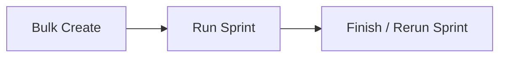

# commander — Flow

Machine-generated from the target's own docs and atlas. Lookout does not invent features or stages. Product lifecycle comes from PRODUCT.md when present; the shared Commander sprint template in `docs/workflow.md` is listed separately as how work ships.

## Product lifecycle

Extracted from `commander` `docs/workflow.md` (3 stage heading(s)).

### Stage 1 — Bulk Create

Turn raw ideas into GitHub issues that are ready to run.

### Stage 2 — Run Sprint

For each ticket in the sprint, the Coder writes the code and the Tester validates it. Driven by `services/sprint_manager/sprint_manager.py`.

### Stage 3 — Finish / Rerun Sprint

The human reviews what reached UAT and wraps the sprint up — or reruns the tickets that need more work.

## Architecture (from the project)

_`docs/architecture.md` has no `flowchart LR` mermaid block to copy._

## Sitemap

Feature inventory lives in the atlas: [[projects/commander/atlas/index]].

Docs recorded in the latest snapshot:

- `README.md`
- `PRODUCT.md`
- `DESIGN.md`
- `SCHEMA.md`
- `docs/TRAVEL_PLAYBOOK.md`
- `docs/agent-guide.md`
- `docs/architecture/0_content.md`
- `docs/architecture/10_devops.md`
- `docs/architecture/11_remote-work.md`
- `docs/architecture/12_security-and-secrets.md`
- `docs/architecture/13_observability-and-cost.md`
- `docs/architecture/14_roadmap-and-sequencing.md`
- `docs/architecture/1_state-and-source-of-truth.md`
- `docs/architecture/2.3a-frontend-module-boundaries.md`
- `docs/architecture/2_app-dashboard-architecture.md`
- `docs/architecture/3_sprint-flow.md`
- `docs/architecture/4_agents.md`
- `docs/architecture/5_concurrency-and-locking.md`
- `docs/architecture/6_failure-and-recovery.md`
- `docs/architecture/7_git-branch-strategy.md`
- `docs/architecture/8_database-and-local-env.md`
- `docs/architecture/9_multiple-projects.md`
- `docs/architecture/boundaries.md`
- `docs/architecture/code-state.md`
- `docs/architecture/frontend-map.md`
- `docs/architecture/open-questions-2026-07-02.md`
- `docs/architecture/sprint-lifecycle.md`
- `docs/architecture.md`
- `docs/bug-audit-2026-07-02.md`
- `docs/bulk-create/2026-06-17-1-calibration-analytics-fix.md`
- `docs/bulk-create/2026-06-21-2-planning-definition-of-ready.md`
- `docs/bulk-create/2026-06-21-3-dashboard-quick-wins.md`
- `docs/changelog/prd/2026-05-25-sprint-5.md`
- `docs/changelog/prd/2026-05-27-sprint-99.md`
- `docs/changelog/prd/2026-06-14-hotfix-board-history-running-ux.md`
- `docs/changelog/prd/_template.md`
- `docs/changelog/uat/2026-05-26-sprint-6.md`
- `docs/changelog/uat/2026-05-28-sprint-16.md`
- `docs/changelog/uat/2026-05-28-sprint-20.md`
- `docs/changelog/uat/2026-05-29-sprint-22.md`
- `docs/changelog/uat/_template.md`
- `docs/decisions/2026-07-02-1-delete-planned-state-and-signoff.md`
- `docs/decisions/2026-07-02-10-close-without-uat-is-waive.md`
- `docs/decisions/2026-07-02-11-reconcile-ttl-and-cursor.md`
- `docs/decisions/2026-07-02-12-delete-lineage-fully-in-develop.md`
- `docs/decisions/2026-07-02-13-neon-export-only-docstrings.md`
- `docs/decisions/2026-07-02-2-merge-sprint-rework-soft-guard.md`
- `docs/decisions/2026-07-02-3-sweep-auto-settle-confirmed-orphans.md`
- `docs/decisions/2026-07-02-4-consolidate-lineage-into-db.md`
- `docs/decisions/2026-07-02-5-delete-duplicate-lifecycle-accessor.md`
- `docs/decisions/2026-07-02-6-draft-db-row-at-create.md`
- `docs/decisions/2026-07-02-7-sqlite-wal-busy-timeout.md`
- `docs/decisions/2026-07-02-8-unify-run-lock-sentinel.md`
- `docs/decisions/2026-07-02-9-bless-disk-fallbacks.md`
- `docs/decisions/2026-08-01-1-delete-roadmap-and-advisor.md`
- `docs/decisions/README.md`
- `docs/decisions/TEMPLATE.md`
- `docs/deck-urls.md`
- `docs/features/README.md`
- `docs/features/agent-skills.md`
- `docs/features/api.md`
- `docs/features/coder-backends.md`
- `docs/features/dashboard.md`
- `docs/features/estimation-lifecycle.md`
- `docs/features/sprint-manager.md`
- `docs/impeccable-detect-baseline.md`
- `docs/logging-schema.md`
- `docs/machine-onboarding.md`
- `docs/milestones/board-aggregate-api.md`
- `docs/milestones/commander-shrink-2026-08.md`
- `docs/milestones/post-lifecycle-backlog.md`
- `docs/milestones/sprint-lifecycle-redesign.md`
- `docs/quickstart.md`
- `docs/runbook-db-recovery.md`
- `docs/runbook.md`
- `docs/smoke-tests/sprint-drag.md`
- `docs/testing/sandbox-repo.md`
- `docs/todo.md`
- `docs/tutorial.md`
- `docs/workflow.md`

