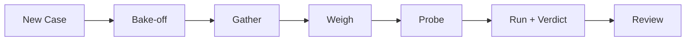

# crux — Discovery

Start-here page for this project: product flow, API map, shallow module map, and atlas. Machine-generated from docs, the latest snapshot, and the local clone. Lookout does not invent edges.

## One-liner

Crux is a research and diagnosis tool that transforms a messy problem into falsifiable hypotheses, generates and researches three competing root-cause explanations (A/B/C) with cited sources, re-ranks them against your data, and designs short/medium/long-horizon experiments to settle the question. It's designed for individuals (particularly engineers) diagnosing performance bottlenecks or other technical mysteries to move from uncertainty to an action plan backed by structured hypothesis testing.

## Product flow

From `crux` `PRODUCT.md` (7 step(s)). Full detail: [[projects/crux/flow]].

- **New Case** — Paste a messy problem → crux returns a sharpened, falsifiable statement + a "not investigating" list. *(Stage 0)*
- **Bake-off** — crux generates Plan A/B/C — rival bets with mechanism + prior each. *(Stage 1)*
- **Gather** — The custom research loop fetches and synthesises evidence per Plan from web/articles/YouTube, every claim carrying a citation. *(Stage 2)*
- **Weigh** — I paste my own numbers/context; crux re-ranks the Plans by fit to *me* and flags any I can already rule in/out. *(Stage 3)*
- **Probe** — crux designs the cheapest decisive test, classifies its type, and names the one metric. If `prototype`, it generates a commander ticket spec. *(Stage 4)*
- **Run + Verdict** — I run the probe (or commander builds the prototype and I UAT it), then log the Verdict. The action plan unlocks. *(Stage 5 + gate)*
- **Review** — Verdict log and Case history surface prior confirmed/killed learnings when I open a related new Case.

## API map

Documented GET surfaces from the latest snapshot. Atlas / Handler columns fill when an atlas note cites the path (deterministic join — no live server calls).

| API name | API | Example | Atlas | Handler |
|---|---|---|---|---|
| {status, env}' — no auth required | `GET /healthz` | `curl -sS http://localhost:8000/healthz` → `200 JSON — {status, env}' — no auth required` | — | — |
| List all cases, newest first | `GET /api/cases` | `curl -sS http://localhost:8000/api/cases` → `200 JSON — List all cases, newest first` | — | — |
| Full case with nested plans, sources, probe, verdict | `GET /api/cases/{id}` | `curl -sS http://localhost:8000/api/cases/example` → `200 JSON — Full case with nested plans, sources, probe, verdict` | — | — |
| Cosine similarity against closed cases | `GET /api/cases/{id}/related` | `curl -sS http://localhost:8000/api/cases/example/related` → `200 JSON — Cosine similarity against closed cases` | — | — |
| List sources for a plan | `GET /api/sources?plan_id={id}` | `curl -sS http://localhost:8000/api/sources?plan_id=example` → `200 JSON — List sources for a plan` | — | — |
| Poll: '{gather_status, error, sources} | `GET /api/plans/{id}/gather-status` | `curl -sS http://localhost:8000/api/plans/example/gather-status` → `200 JSON — Poll: '{gather_status, error, sources}` | — | — |

## Module map

Shallow map of entry points and top-level packages under the `crux` clone (deterministic import skim, capped at 15 nodes). Not a full call graph.

Top-level modules:

- `scripts/`

## Feature atlas

[[projects/crux/atlas/index|Atlas index]] — **0** traced / **0** features.

## Read next

- [[projects/crux/situation|Situation]] — current state

- [[projects/crux/capability|Capability]] — full API card

- [[projects/crux/flow|Flow]] — product lifecycle + how work ships

- [[projects/crux/changelog|Changelog]] — PRs and git history

- [[projects/crux/todo-view|Todo view]] — open work

