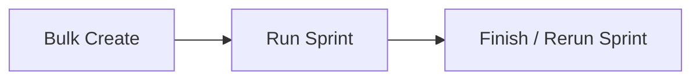

# crux — Flow

Machine-generated from the target's own docs and atlas. Lookout does not invent features or stages. Product lifecycle comes from PRODUCT.md when present; the shared Commander sprint template in `docs/workflow.md` is listed separately as how work ships.

## Product lifecycle

Extracted from `crux` `PRODUCT.md` (7 numbered step(s)).

### New Case

Paste a messy problem → crux returns a sharpened, falsifiable statement + a "not investigating" list. *(Stage 0)*

### Bake-off

crux generates Plan A/B/C — rival bets with mechanism + prior each. *(Stage 1)*

### Gather

The custom research loop fetches and synthesises evidence per Plan from web/articles/YouTube, every claim carrying a citation. *(Stage 2)*

### Weigh

I paste my own numbers/context; crux re-ranks the Plans by fit to *me* and flags any I can already rule in/out. *(Stage 3)*

### Probe

crux designs the cheapest decisive test, classifies its type, and names the one metric. If `prototype`, it generates a commander ticket spec. *(Stage 4)*

### Run + Verdict

I run the probe (or commander builds the prototype and I UAT it), then log the Verdict. The action plan unlocks. *(Stage 5 + gate)*

### Review

Verdict log and Case history surface prior confirmed/killed learnings when I open a related new Case.

## How work ships

From `crux` `docs/workflow.md` — the Commander sprint pipeline used to build this project (3 stage(s)). This is how tickets ship, not the end-user product flow.

### Stage 1 — Bulk Create

- Paste prompts (separated by `---`) into the Bulk Create tab. - **BA agent** drafts each ticket (title, body, AC, UAT steps), one per prompt. - **Estimator** sizes each draft (S/M/L/XL). - Review and edit the drafts, then post the selected ones as GitHub issues.

### Stage 2 — Run Sprint

For each ticket in a `sprint-N` label:

### Stage 3 — Finish / Rerun Sprint

- **Finish:** the human reviews UAT tickets, closes the good ones; a sprint summary is posted as a GitHub issue, which marks the sprint finished. - **Rerun:** tickets tagged `needs-rework` run as an independent sub-sprint (`sprint-N.1`, `sprint-N.2`, …) with their own label, branch, PR, and summary.

## Architecture (from the project)

_`docs/architecture.md` has no `flowchart LR` mermaid block to copy._

## Sitemap

Feature inventory lives in the atlas: [[projects/crux/atlas/index]].

Docs recorded in the latest snapshot:

- `README.md`
- `PRODUCT.md`
- `DESIGN.md`
- `SCHEMA.md`
- `docs/architecture.md`
- `docs/bulk-create/2026-06-19-m0-foundation.md`
- `docs/bulk-create/2026-06-19-m1-case-spine.md`
- `docs/bulk-create/2026-06-19-m2-research-loop.md`
- `docs/bulk-create/2026-06-19-m3-commander-bridge.md`
- `docs/bulk-create/2026-06-19-m4-verdict-memory.md`
- `docs/bulk-create/2026-06-20-m5-probe-lifecycle.md`
- `docs/bulk-create/2026-06-20-m6-verdicts-screen.md`
- `docs/bulk-create/2026-06-20-m7-case-search-and-editing.md`
- `docs/bulk-create/2026-06-20-m8-embedding-related-cases.md`
- `docs/bulk-create/2026-06-22-m9-real-source-suggestions.md`
- `docs/bulk-create/2026-07-03-1-crux-multi-horizon-probes.md`
- `docs/bulk-create/2026-07-03-2-crux-source-detail-modal.md`
- `docs/bulk-create/2026-07-03-3-crux-paper-style-summary.md`
- `docs/bulk-create/README.md`
- `docs/features/README.md`
- `docs/milestones.md`
- `docs/quickstart.md`
- `docs/tutorial.md`
- `docs/workflow.md`

