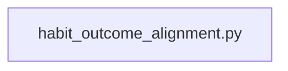

## What

Habit-outcome alignment — traced from `backend/services/habit_outcome_alignment.py` through 1 source file(s).

## Entry Points

- `backend/services/habit_outcome_alignment.py` (tracing origin)

## Related Issues

_No related issues found in snapshot._

## Flowchart

## Key Files

- `habit_outcome_alignment.py` — traced during import walk
