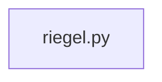

## What

Riegel cross-distance equivalence — traced from `tests/test_riegel_cross_distance_equivalence__1109.py` through 1 source file(s).

## Entry Points

- `tests/test_riegel_cross_distance_equivalence__1109.py` (tracing origin)

## Related Issues

_No related issues found in snapshot._

## Flowchart

## Key Files

- `riegel.py` — traced during import walk

## Open Questions

<!-- OPEN QUESTION: `pytest` imported in `test_riegel_cross_distance_equivalence__1109.py` but `pytest.py` not found in source — handler unresolved -->
