## What

Run View — traced from `tests/test_1368_run_form_metrics.py` through 4 source file(s).

## Entry Points

- `tests/test_1368_run_form_metrics.py` (tracing origin)

## Related Issues

- #1715 — [pre-prd-review] docs/release-process.md doesn't account for large migration-batch releases (no PITR/snapshot guidance)
- #1710 — [pre-prd-review] CLAUDE.md's "exactly one LLM surface" claim is contradicted by 4 other live LLM call sites
- #1708 — [pre-prd-review] Several integration secrets not declared even as placeholders in render.yaml

## Flowchart

```mermaid
flowchart LR
  auth_py[auth.py]
  db_py[db.py]
  models_py[models.py]
  form_metrics_extractor_py[form_metrics_extractor.py]
  users[(users)]
  weight_entries[(weight_entries)]
  weight_targets[(weight_targets)]
  habits[(habits)]
  habit_logs[(habit_logs)]
  workouts[(workouts)]
  workout_exercises[(workout_exercises)]
  workout_splits[(workout_splits)]
  daily_metrics[(daily_metrics)]
  fuel_settings[(fuel_settings)]
  fuel_entries[(fuel_entries)]
  personal_records[(personal_records)]
  strength_personal_records[(strength_personal_records)]
  strength_record_achievements[(strength_record_achievements)]
  strava_tokens[(strava_tokens)]
  google_oauth_credentials[(google_oauth_credentials)]
  drive_sleep_connections[(drive_sleep_connections)]
  stryd_credentials[(stryd_credentials)]
  strava_activities[(strava_activities)]
  daily_readiness[(daily_readiness)]
  stryd_activities[(stryd_activities)]
  removed_activities[(removed_activities)]
  workout_feel[(workout_feel)]
  sleep_imports[(sleep_imports)]
  app_config[(app_config)]
  workout_templates[(workout_templates)]
  user_preferences[(user_preferences)]
  training_load_snapshots[(training_load_snapshots)]
  sync_jobs[(sync_jobs)]
  worker_job_runs[(worker_job_runs)]
  job_queue[(job_queue)]
  activity_streams[(activity_streams)]
  races[(races)]
  race_checkpoints[(race_checkpoints)]
  race_calibrations[(race_calibrations)]
  race_predictions[(race_predictions)]
  athlete_duration_curves[(athlete_duration_curves)]
  sleep_records[(sleep_records)]
  training_plans[(training_plans)]
  planned_load[(planned_load)]
  strength_sessions[(strength_sessions)]
  plyo_sessions[(plyo_sessions)]
  economy_ceiling_snapshots[(economy_ceiling_snapshots)]
  user_banister_params[(user_banister_params)]
  summary_cache[(summary_cache)]
  planned_sessions[(planned_sessions)]
  exercise_catalog[(exercise_catalog)]
  injury_log[(injury_log)]
  llm_generations[(llm_generations)]
  verdict_history[(verdict_history)]
  body_measurements[(body_measurements)]
  performance_score_history[(performance_score_history)]
  run_form_metrics[(run_form_metrics)]
  prediction_snapshots[(prediction_snapshots)]
  muscle_load_daily[(muscle_load_daily)]
  gap_findings[(gap_findings)]
  performance_goals[(performance_goals)]
  decisions[(decisions)]
  calibration_sprints[(calibration_sprints)]
  weekly_coach_messages[(weekly_coach_messages)]
  daily_briefs[(daily_briefs)]
  plan_drafts[(plan_drafts)]
  training_preferences[(training_preferences)]
  preference_proposals[(preference_proposals)]
  user_custom_presets[(user_custom_presets)]
  plan_patterns[(plan_patterns)]
  plan_exercises[(plan_exercises)]
  preference_import_audits[(preference_import_audits)]
  auth_py --> db_py
  db_py --> models_py
  models_py --> form_metrics_extractor_py
  form_metrics_extractor_py --> users
  form_metrics_extractor_py --> weight_entries
  form_metrics_extractor_py --> weight_targets
  form_metrics_extractor_py --> habits
  form_metrics_extractor_py --> habit_logs
  form_metrics_extractor_py --> workouts
  form_metrics_extractor_py --> workout_exercises
  form_metrics_extractor_py --> workout_splits
  form_metrics_extractor_py --> daily_metrics
  form_metrics_extractor_py --> fuel_settings
  form_metrics_extractor_py --> fuel_entries
  form_metrics_extractor_py --> personal_records
  form_metrics_extractor_py --> strength_personal_records
  form_metrics_extractor_py --> strength_record_achievements
  form_metrics_extractor_py --> strava_tokens
  form_metrics_extractor_py --> google_oauth_credentials
  form_metrics_extractor_py --> drive_sleep_connections
  form_metrics_extractor_py --> stryd_credentials
  form_metrics_extractor_py --> strava_activities
  form_metrics_extractor_py --> daily_readiness
  form_metrics_extractor_py --> stryd_activities
  form_metrics_extractor_py --> removed_activities
  form_metrics_extractor_py --> workout_feel
  form_metrics_extractor_py --> sleep_imports
  form_metrics_extractor_py --> app_config
  form_metrics_extractor_py --> workout_templates
  form_metrics_extractor_py --> user_preferences
  form_metrics_extractor_py --> training_load_snapshots
  form_metrics_extractor_py --> sync_jobs
  form_metrics_extractor_py --> worker_job_runs
  form_metrics_extractor_py --> job_queue
  form_metrics_extractor_py --> activity_streams
  form_metrics_extractor_py --> races
  form_metrics_extractor_py --> race_checkpoints
  form_metrics_extractor_py --> race_calibrations
  form_metrics_extractor_py --> race_predictions
  form_metrics_extractor_py --> athlete_duration_curves
  form_metrics_extractor_py --> sleep_records
  form_metrics_extractor_py --> training_plans
  form_metrics_extractor_py --> planned_load
  form_metrics_extractor_py --> strength_sessions
  form_metrics_extractor_py --> plyo_sessions
  form_metrics_extractor_py --> economy_ceiling_snapshots
  form_metrics_extractor_py --> user_banister_params
  form_metrics_extractor_py --> summary_cache
  form_metrics_extractor_py --> planned_sessions
  form_metrics_extractor_py --> exercise_catalog
  form_metrics_extractor_py --> injury_log
  form_metrics_extractor_py --> llm_generations
  form_metrics_extractor_py --> verdict_history
  form_metrics_extractor_py --> body_measurements
  form_metrics_extractor_py --> performance_score_history
  form_metrics_extractor_py --> run_form_metrics
  form_metrics_extractor_py --> prediction_snapshots
  form_metrics_extractor_py --> muscle_load_daily
  form_metrics_extractor_py --> gap_findings
  form_metrics_extractor_py --> performance_goals
  form_metrics_extractor_py --> decisions
  form_metrics_extractor_py --> calibration_sprints
  form_metrics_extractor_py --> weekly_coach_messages
  form_metrics_extractor_py --> daily_briefs
  form_metrics_extractor_py --> plan_drafts
  form_metrics_extractor_py --> training_preferences
  form_metrics_extractor_py --> preference_proposals
  form_metrics_extractor_py --> user_custom_presets
  form_metrics_extractor_py --> plan_patterns
  form_metrics_extractor_py --> plan_exercises
  form_metrics_extractor_py --> preference_import_audits
```

## Key Files

- `auth.py` — traced during import walk
- `db.py` — traced during import walk
- `models.py` — traced during import walk
- `form_metrics_extractor.py` — traced during import walk

## Open Questions

<!-- OPEN QUESTION: `httpx` imported in `test_1368_run_form_metrics.py` but `httpx.py` not found in source — handler unresolved -->
<!-- OPEN QUESTION: `pytest` imported in `test_1368_run_form_metrics.py` but `pytest.py` not found in source — handler unresolved -->
<!-- OPEN QUESTION: `sqlalchemy` imported in `test_1368_run_form_metrics.py` but `sqlalchemy.py` not found in source — handler unresolved -->
<!-- OPEN QUESTION: `fastapi` imported in `auth.py` but `fastapi.py` not found in source — handler unresolved -->
<!-- OPEN QUESTION: `sqlalchemy` imported in `db.py` but `sqlalchemy.py` not found in source — handler unresolved -->
<!-- OPEN QUESTION: `dotenv` imported in `db.py` but `dotenv.py` not found in source — handler unresolved -->
<!-- OPEN QUESTION: `sqlalchemy` imported in `models.py` but `sqlalchemy.py` not found in source — handler unresolved -->
