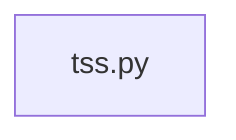

## What

Strength TSS — traced from `tests/test_strength_tss__688.py` through 1 source file(s).

## Entry Points

- `tests/test_strength_tss__688.py` (tracing origin)

## Related Issues

- #1672 — [follow-up] Log instead of silently swallowing malformed sets_json in get_strength_tss_per_set_for_workout
- #1653 — [follow-up] Document/bound ACWR-ceiling overshoot from TSS floor re-clamp in remove(redistribute)

## Flowchart

## Key Files

- `tss.py` — traced during import walk

## Open Questions

<!-- OPEN QUESTION: `sqlalchemy` imported in `tss.py` but `sqlalchemy.py` not found in source — handler unresolved -->
