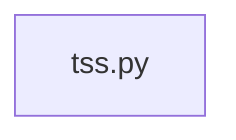

## What

Strength View — traced from `tests/test_compute_strength_tss__594.py` through 1 source file(s).

## Entry Points

- `tests/test_compute_strength_tss__594.py` (tracing origin)

## Related Issues

- #1715 — [pre-prd-review] docs/release-process.md doesn't account for large migration-batch releases (no PITR/snapshot guidance)
- #1710 — [pre-prd-review] CLAUDE.md's "exactly one LLM surface" claim is contradicted by 4 other live LLM call sites
- #1708 — [pre-prd-review] Several integration secrets not declared even as placeholders in render.yaml
- #1672 — [follow-up] Log instead of silently swallowing malformed sets_json in get_strength_tss_per_set_for_workout

## Flowchart

## Key Files

- `tss.py` — traced during import walk

## Open Questions

<!-- OPEN QUESTION: `sqlalchemy` imported in `tss.py` but `sqlalchemy.py` not found in source — handler unresolved -->
