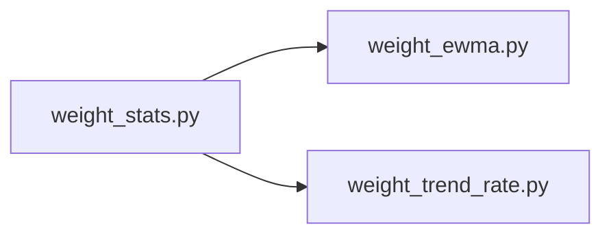

## What

Weight tracking — traced from `weight_stats.py` through 3 source file(s).

## Entry Points

- `weight_stats.py` (tracing origin)

## Related Issues

_No related issues found in snapshot._

## Flowchart

## Key Files

- `weight_stats.py` — traced during import walk
- `weight_ewma.py` — traced during import walk
- `weight_trend_rate.py` — traced during import walk
