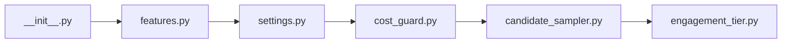

## What

candidate-sampler — traced from `tests/test_candidate_sampler__24.py` through 6 source file(s).

## Entry Points

- `tests/test_candidate_sampler__24.py` (tracing origin)

## Related Issues

_No related issues found in snapshot._

## Flowchart

## Key Files

- `__init__.py` — traced during import walk
- `features.py` — traced during import walk
- `settings.py` — traced during import walk
- `cost_guard.py` — traced during import walk
- `candidate_sampler.py` — traced during import walk
- `engagement_tier.py` — traced during import walk

## Open Questions

<!-- OPEN QUESTION: `pytest` imported in `test_candidate_sampler__24.py` but `pytest.py` not found in source — handler unresolved -->
