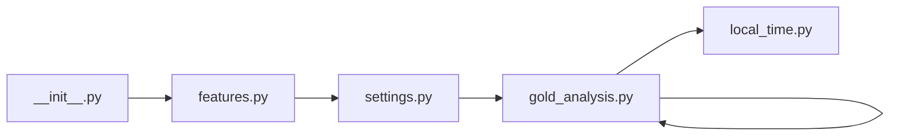

## What

gold-analysis — traced from `tests/test_gold_analysis__18.py` through 6 source file(s).

## Entry Points

- `tests/test_gold_analysis__18.py` (tracing origin)

## Related Issues

- #176 — [review] Gold-analysis cost estimate shown to user doesn't match the batch actually executed
- #150 — Persist gold-analysis job state in SQLite

## Flowchart

## Key Files

- `__init__.py` — traced during import walk
- `features.py` — traced during import walk
- `settings.py` — traced during import walk
- `gold_analysis.py` — traced during import walk
- `gold_analysis.py` — traced during import walk
- `local_time.py` — traced during import walk

## Open Questions

<!-- OPEN QUESTION: `pytest` imported in `test_gold_analysis__18.py` but `pytest.py` not found in source — handler unresolved -->
