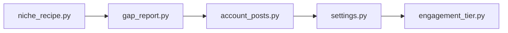

## What

niche-recipe — traced from `services/niche_recipe.py` through 5 source file(s).

## Entry Points

- `services/niche_recipe.py` (tracing origin)

## Related Issues

_No related issues found in snapshot._

## Flowchart

## Key Files

- `niche_recipe.py` — traced during import walk
- `gap_report.py` — traced during import walk
- `account_posts.py` — traced during import walk
- `settings.py` — traced during import walk
- `engagement_tier.py` — traced during import walk
