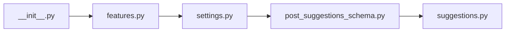

## What

suggestions — traced from `tests/test_suggestions__28.py` through 5 source file(s).

## Entry Points

- `tests/test_suggestions__28.py` (tracing origin)

## Related Issues

_No related issues found in snapshot._

## Flowchart

## Key Files

- `__init__.py` — traced during import walk
- `features.py` — traced during import walk
- `settings.py` — traced during import walk
- `post_suggestions_schema.py` — traced during import walk
- `suggestions.py` — traced during import walk
