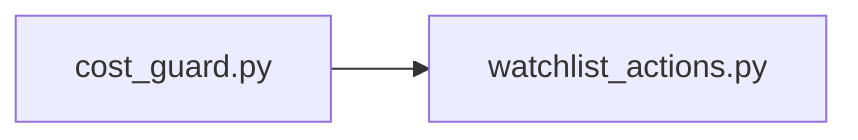

## What

Watchlist — traced from `tests/test_watchlist_actions.py` through 2 source file(s).

## Entry Points

- `tests/test_watchlist_actions.py` (tracing origin)

## Related Issues

_No related issues found in snapshot._

## Flowchart

## Key Files

- `cost_guard.py` — traced during import walk
- `watchlist_actions.py` — traced during import walk

## Open Questions

<!-- OPEN QUESTION: `pytest` imported in `test_watchlist_actions.py` but `pytest.py` not found in source — handler unresolved -->
