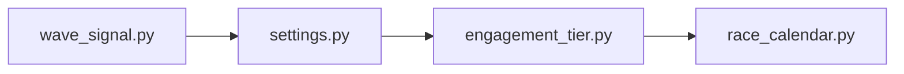

## What

wave-signal — traced from `services/wave_signal.py` through 4 source file(s).

## Entry Points

- `services/wave_signal.py` (tracing origin)

## Related Issues

_No related issues found in snapshot._

## Flowchart

## Key Files

- `wave_signal.py` — traced during import walk
- `settings.py` — traced during import walk
- `engagement_tier.py` — traced during import walk
- `race_calendar.py` — traced during import walk
