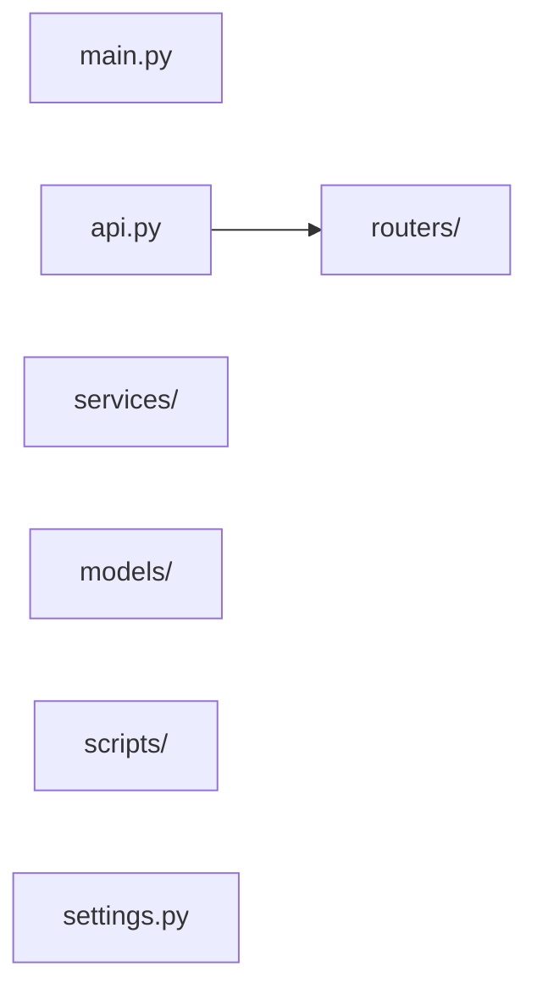

# viral-radar — Discovery

Start-here page for this project: product flow, API map, shallow module map, and atlas. Machine-generated from docs, the latest snapshot, and the local clone. Lookout does not invent edges.

## One-liner

Viral-Radar is a Facebook content analytics service for creators and marketers that ingests posts, classifies engagement tiers per account, and identifies the features distinguishing high-performing content. It discovers candidate creator accounts, generates AI-powered post suggestions tailored to niche-specific engagement patterns, and surfaces content strategy gaps.

## Product flow

From `viral-radar` `PRODUCT.md` (3 step(s)). Full detail: [[projects/viral-radar/flow]].

- **Find the wave** — Surface which races/events/topics currently have an
- **Prove the recipe** — Replace hunches with data: what structurally
- **Protect the voice** — Any generated output is structure only (angles,

## API map

Documented GET surfaces from the latest snapshot. Atlas / Handler columns fill when an atlas note cites the path (deterministic join — no live server calls).

| API name | API | Example | Atlas | Handler |
|---|---|---|---|---|
| Gold post feed filtered to the last N days (7, 30, or 90) | `GET /api/digest?days=30` | `curl -sS http://localhost:8000/api/digest?days=30` → `200 JSON — Gold post feed filtered to the last N days (7, 30, or 90)` | — | — |
| Post detail including AI analysis fields | `GET /api/posts/{post_id}` | `curl -sS http://localhost:8000/api/posts/example` → `200 JSON — Post detail including AI analysis fields` | — | — |
| Niche recipe: equal-weighted signal aggregation with AI blend and example posts | `GET /niches/{niche_id}/recipe` | `curl -sS http://localhost:8000/niches/example/recipe` → `200 JSON — Niche recipe: equal-weighted signal aggregation with AI blend and example posts` | — | — |
| Return the cached quarantine scorecard for a candidate without re-scraping | `GET /candidates/{id}/sample` | `curl -sS http://localhost:8000/candidates/example/sample` → `200 JSON — Return the cached quarantine scorecard for a candidate without re-scraping` | — | — |
| Discovery UI — 'static/suggestions.html | `GET /suggestions` | `curl -sS http://localhost:8000/suggestions` → `200 JSON — Discovery UI — 'static/suggestions.html` | — | — |
| List all content suggestions | `GET /api/suggestions` | `curl -sS http://localhost:8000/api/suggestions` → `200 JSON — List all content suggestions` | — | — |
| Export a kept suggestion as a prose-free skeleton Markdown draft | `GET /api/suggestions/{id}/export` | `curl -sS http://localhost:8000/api/suggestions/example/export` → `200 JSON — Export a kept suggestion as a prose-free skeleton Markdown draft` | — | — |
| List engagement waves available as sources for AI post suggestions | `GET /api/waves` | `curl -sS http://localhost:8000/api/waves` → `200 JSON — List engagement waves available as sources for AI post suggestions` | — | — |
| List previously generated suggestions for a wave | `GET /api/waves/{wave}/suggestions` | `curl -sS http://localhost:8000/api/waves/example/suggestions` → `200 JSON — List previously generated suggestions for a wave` | — | — |
| Get the stored voice-notes guidance used to steer suggestion generation | `GET /api/settings/voice-notes` | `curl -sS http://localhost:8000/api/settings/voice-notes` → `200 JSON — Get the stored voice-notes guidance used to steer suggestion generation` | — | — |
| Gap report: gold-post signals present in the niche recipe but missing from an account | `GET /niches/{niche_id}/gap-report?account=<name>` | `curl -sS http://localhost:8000/niches/example/gap-report?account=<name>` → `200 JSON — Gap report: gold-post signals present in the niche recipe but missing from an account` | — | — |
| Return the current self account, or null if none is registered | `GET /self-account` | `curl -sS http://localhost:8000/self-account` → `200 JSON — Return the current self account, or null if none is registered` | — | — |
| Return posts for the self account (powers the Self tab) | `GET /self-account/posts` | `curl -sS http://localhost:8000/self-account/posts` → `200 JSON — Return posts for the self account (powers the Self tab)` | — | — |
| List watchlist accounts, excluding the self account | `GET /accounts` | `curl -sS http://localhost:8000/accounts` → `200 JSON — List watchlist accounts, excluding the self account` | — | — |

## Module map

Shallow map of entry points and top-level packages under the `viral-radar` clone (deterministic import skim, capped at 15 nodes). Not a full call graph.

## Feature atlas

[[projects/viral-radar/atlas/index|Atlas index]] — **0** traced / **0** features.

## Read next

- [[projects/viral-radar/situation|Situation]] — current state

- [[projects/viral-radar/capability|Capability]] — full API card

- [[projects/viral-radar/flow|Flow]] — product lifecycle + how work ships

- [[projects/viral-radar/changelog|Changelog]] — PRs and git history

- [[projects/viral-radar/todo-view|Todo view]] — open work

